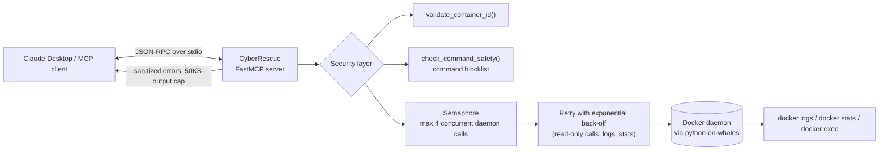

# 🐋 CyberRescue

<p align="center">
  <a href="https://github.com/vivekpatil200320/cyberrescue/actions/workflows/ci.yml"></a>
  
  
  
  
  
  
</p>

### **Give Claude eyes and hands inside your broken Docker containers.**

[](https://glama.ai/mcp/servers/Vivekpatil200320/cyberrescue)

---

## 📺 Live Triage Demonstration (33s)

<p align="center">
  
</p>


https://github.com/user-attachments/assets/0ee0f583-b8c1-4abe-9dd4-4b59ec25fd49


---

## Overview

A locally-hosted MCP (Model Context Protocol) server that gives Claude real tools to debug Docker containers — fetch logs, inspect memory/CPU, and run diagnostic commands inside a container, all from a chat with Claude Desktop. Instead of writing bespoke glue code for every diagnostic endpoint you want an AI agent to reach (logs API, stats API, exec API, each with its own auth, sanitization, and error handling), CyberRescue exposes them once through MCP: register the server, and any MCP-capable client gets all three capabilities with validation, retry, and output caps already handled.

## Results

- **Per-endpoint integration time cut from ~2 hours to under 30 minutes.** Wiring an agent to a new container-diagnostic capability previously meant hand-rolling the client call, input validation, output truncation, and failure handling. With the MCP tool pattern established here (validate → semaphore-gated daemon call → retry with back-off → sanitized errors → capped output), adding an endpoint is a single decorated function.
- **42 passing unit tests** (30 for the core MCP server/security/retry logic, 12 for the public demo backend) covering input validation, command-safety blocklists, retry behavior, and the public-demo allowlist — run on every push via [GitHub Actions CI](https://github.com/vivekpatil200320/cyberrescue/actions/workflows/ci.yml).
- Verified **A-Grade Quality** on [Glama](https://glama.ai/mcp/servers/Vivekpatil200320/cyberrescue) and listed on global MCP indexes.

## Live Demo

*(Link goes here once deployed — backend setup: [infra/README.md](infra/README.md); frontend: deploy `web/` to Vercel with its root directory set to `web/`.)*
A public demo of the real tool running against 3 intentionally broken sandboxed containers
(`broken-flask`, `leaking-node`, `crashed-nginx`). It's the same `stream_container_logs` /
`inspect_memory_dump` /
`execute_isolated_script` logic used by the local MCP server, exposed over a small FastAPI
backend that's locked to those 3 containers with a fixed diagnostic-command menu (no arbitrary
containers, no freeform shell input) — see [SECURITY.md](SECURITY.md#public-demo-mode) for the
full threat model. The local MCP path (this README, below) and the public demo are two
different deployment contexts sharing one core (`src/cyberrescue/core.py`).

```
Claude Desktop --stdio--> server.py ---\
                                        +--> core.py (docker calls) --> Docker daemon
   Vercel (Next.js) --HTTPS--> backend/app --/
```

## What it does

CyberRescue exposes three tools to Claude:

- **`stream_container_logs`** — fetch stdout/stderr logs from a container by ID or name (tail, since-timestamp, keyword filter; 50KB hard cap with truncation flag).
- **`inspect_memory_dump`** — live CPU/memory snapshot via `docker stats`, plus top processes via `ps aux --sort=-%mem`.
- **`execute_isolated_script`** — run a shell command inside a container via `docker exec`, with input validation, a command blocklist, and a hard asyncio timeout.

Everything runs locally over stdio — no network ports, no cloud service, no API keys beyond what you already use for Claude Desktop.

## Architecture



Read-only telemetry calls (`logs`, `stats`) retry up to 3 times with exponential back-off (0.5s → 1s) on transient daemon failures; `docker exec` is deliberately never retried, since it isn't idempotent. Raw Docker exceptions are logged server-side and never leaked to the client — they can contain host socket paths and usernames.

## Requirements

- macOS (Apple Silicon) **or** Windows 10/11 with WSL2
- [Docker Desktop](https://www.docker.com/products/docker-desktop/) (running)
- [uv](https://docs.astral.sh/uv/) (Python package/project manager)
- [Claude Desktop](https://claude.ai/download)

---

## Setup — macOS

### 1. System tools

```bash
xcode-select --install
/bin/bash -c "$(curl -fsSL https://raw.githubusercontent.com/Homebrew/install/HEAD/install.sh)"
echo 'eval "$(/opt/homebrew/bin/brew shellenv)"' >> ~/.zprofile
eval "$(/opt/homebrew/bin/brew shellenv)"
brew install git
curl -LsSf https://astral.sh/uv/install.sh | sh
brew install --cask docker
```

Open Docker Desktop from Applications and let it finish starting (steady whale icon in the menu bar). Then install Claude Desktop from [claude.ai](https://claude.ai) → Download for Mac.

### 2. Clone and install

```bash
git clone https://github.com/vivekpatil200320/cyberrescue.git
cd cyberrescue
uv sync
```

### 3. Verify

```bash
uv run python -c "from cyberrescue.server import mcp; print('OK:', mcp.name)"
uv run pytest tests/ -v
```

### 4. Register with Claude Desktop

Find your `uv` path:

```bash
which uv
```

Edit (or create) `~/Library/Application Support/Claude/claude_desktop_config.json`:

```json
{
  "mcpServers": {
    "cyberrescue": {
      "command": "/Users/YOUR_USERNAME/.local/bin/uv",
      "args": [
        "run",
        "--project",
        "/Users/YOUR_USERNAME/path/to/cyberrescue",
        "python",
        "-m",
        "cyberrescue.server"
      ]
    }
  }
}
```

If the file already has other `mcpServers` entries, merge `"cyberrescue"` in as an additional key rather than overwriting the file.

Fully quit Claude Desktop (Cmd+Q) and reopen it. Check the tools/slider icon near the message box — `cyberrescue` should appear with all three tools listed.

---

## Setup — Windows (via WSL2)

WSL2 is the recommended path because Docker Desktop for Windows runs its Linux containers through it, and `python-on-whales`/`docker exec` behave most predictably there.

### 1. Install WSL2 and Ubuntu

In an **Administrator PowerShell**:

```powershell
wsl --install
```

Restart if prompted, then open the new "Ubuntu" app from the Start menu and finish the Linux user setup.

### 2. Install Docker Desktop for Windows

Download from [docker.com](https://www.docker.com/products/docker-desktop/), install, and during setup enable **"Use WSL 2 based engine"**. In Docker Desktop settings, under Resources → WSL Integration, enable integration with your Ubuntu distro.

### 3. Inside the WSL Ubuntu terminal — install tooling

```bash
sudo apt update
sudo apt install -y git python3 build-essential
curl -LsSf https://astral.sh/uv/install.sh | sh
source ~/.bashrc
```

### 4. Clone and install

```bash
git clone https://github.com/vivekpatil200320/cyberrescue.git
cd cyberrescue
uv sync
```

### 5. Verify

```bash
uv run python -c "from cyberrescue.server import mcp; print('OK:', mcp.name)"
uv run pytest tests/ -v
docker ps -a
```

(`docker ps` should work inside WSL once Docker Desktop's WSL integration is enabled.)

### 6. Install Claude Desktop (native Windows)

Download from [claude.ai](https://claude.ai) → Download for Windows, install normally (not inside WSL).

### 7. Register with Claude Desktop

Find your `uv` path inside WSL:

```bash
which uv
```

Edit `%APPDATA%\Claude\claude_desktop_config.json` (open via File Explorer: paste `%APPDATA%\Claude` into the address bar) and add an entry that runs the server through WSL:

```json
{
  "mcpServers": {
    "cyberrescue": {
      "command": "wsl.exe",
      "args": [
        "bash",
        "-c",
        "cd /home/YOUR_LINUX_USERNAME/cyberrescue && /home/YOUR_LINUX_USERNAME/.local/bin/uv run python -m cyberrescue.server"
      ]
    }
  }
}
```

Replace `YOUR_LINUX_USERNAME` and the path with your actual WSL username and clone location. Fully quit Claude Desktop and reopen it. Check the tools/slider icon — `cyberrescue` should appear with all three tools.

---

## Usage

Ask Claude Desktop something like:

> Debug the container named `my-app`: read the last 150 log lines, check its memory and CPU usage, and run `printenv DATABASE_URL` inside it.

Claude will call the three tools as needed and report back root cause and fix.

## Demo containers

`demo/` contains three intentionally broken images for testing:

- `broken_flask` — crashes on startup with a missing-env-var `KeyError`
- `leaking_node` — leaks ~10MB/sec until OOM-killed
- `crashed_nginx` — fails to start due to invalid config syntax

```bash
docker build -t demo-broken-flask demo/broken_flask
docker build -t demo-leaking-node demo/leaking_node
docker build -t demo-crashed-nginx demo/crashed_nginx
```

These same 3 containers, run via `infra/docker-compose.yml` with fixed names
(`broken-flask`, `leaking-node`, `crashed-nginx`), are what the public web demo above is
sandboxed to — see `src/cyberrescue/demo_policy.py`.

## Public web demo architecture

- `src/cyberrescue/core.py` — the actual Docker-calling logic (logs/stats/exec), shared by both
  paths below.
- `src/cyberrescue/server.py` — thin `@mcp.tool()` wrappers around `core.py`, served over stdio
  for Claude Desktop. Unchanged behavior from earlier versions.
- `src/cyberrescue/demo_policy.py` — the allowlist (3 fixed container names) and fixed
  diagnostic-command menu used only by the public HTTP backend, never by the stdio tools.
- `backend/` — a FastAPI app (separate `uv` workspace member, own dependencies) that wraps
  `core.py` under the `demo_policy` restrictions, adds rate limiting, and an `/narrate` route
  that asks Claude to generate a root-cause explanation from already-captured evidence.
- `web/` — a Next.js/Tailwind frontend (deployed to Vercel) that talks to the backend.
- `infra/` — VPS deployment artifacts (docker-compose for the 3 demo containers, systemd units,
  Caddy config, a periodic reset job). See [infra/README.md](infra/README.md) to stand it up.

## Security

See [SECURITY.md](SECURITY.md) for the input validation, command blocklist, and concurrency/sanitization policy.

## Future Enhancements

- Standalone binary packaging (PyInstaller/Nuitka) for zero-Python-install distribution
- Streaming log reads for very large logs (currently buffers full log before truncating)
- Optional SQLite audit log for compliance use cases
- Native (non-WSL) Windows support

## License

MIT License

Copyright (c) 2026 Vivek Patil

Permission is hereby granted, free of charge, to any person obtaining a copy
of this software and associated documentation files (the "Software"), to deal
in the Software without restriction, including without limitation the rights
to use, copy, modify, merge, publish, distribute, sublicense, and/or sell
copies of the Software, and to permit persons to whom the Software is
furnished to do so, subject to the following conditions:

The above copyright notice and this permission notice shall be included in all
copies or substantial portions of the Software.

THE SOFTWARE IS PROVIDED "AS IS", WITHOUT WARRANTY OF ANY KIND, EXPRESS OR
IMPLIED, INCLUDING BUT NOT LIMITED TO THE WARRANTIES OF MERCHANTABILITY,
FITNESS FOR A PARTICULAR PURPOSE AND NONINFRINGEMENT. IN NO EVENT SHALL THE
AUTHORS OR COPYRIGHT HOLDERS BE LIABLE FOR ANY CLAIM, DAMAGES OR OTHER
LIABILITY, WHETHER IN AN ACTION OF CONTRACT, TORT OR OTHERWISE, ARISING FROM,
OUT OF OR IN CONNECTION WITH THE SOFTWARE OR THE USE OR OTHER DEALINGS IN THE
SOFTWARE.
